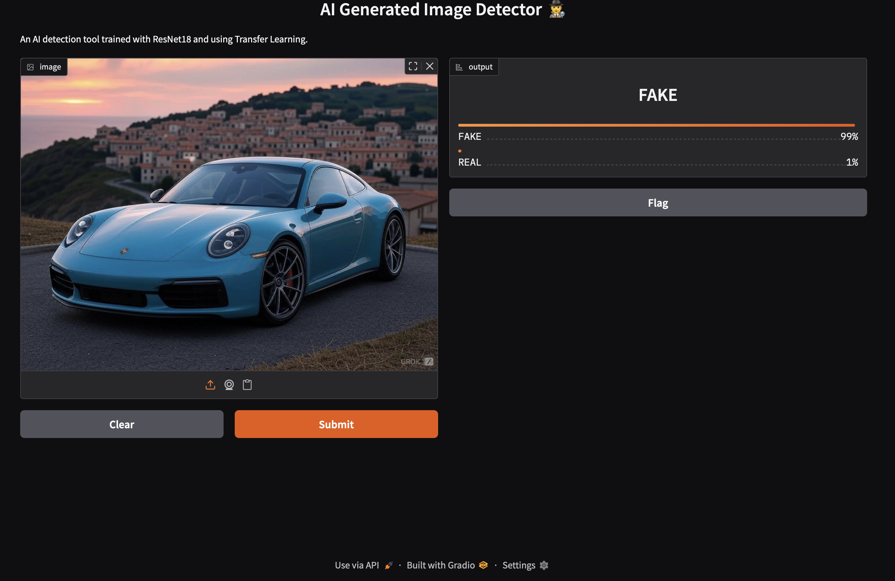

# 🕵️‍♂️ AI vs Real Image Detector


**An AI-powered application capable of distinguishing between real photographs and AI-generated images (Stable Diffusion, Midjourney) with high precision.**

## 📖 Project Overview
With the rise of Generative AI, distinguishing between real and synthetic images has become a critical challenge in digital forensics and information verification. 

This project implements a **Deep Learning** solution using **Transfer Learning** on the **ResNet18** architecture. It is trained on the CIFAKE dataset and deployed as a user-friendly web application using **Gradio**.

### ✨ Key Features
* **High Accuracy:** Achieved **97.20%** accuracy on the CIFAKE test set.
* **Transfer Learning:** Utilized pre-trained ResNet18 weights for robust feature extraction.
* **Real-World Robustness:** Implemented a custom pre-processing pipeline to handle the **Domain Shift** between training data (low-res) and real-world images (high-res).
* **Web Interface:** Interactive drag-and-drop interface for real-time testing.

---

## 📸 Demo



---

## 🛠️ Tech Stack & Methodology

### 1. Model Architecture
* **Backbone:** ResNet18 (Pre-trained on ImageNet).
* **Classifier Head:** Modified Fully Connected layer for binary classification (Real vs Fake).
* **Loss Function:** CrossEntropyLoss.
* **Optimizer:** Adam.

### 2. The "Domain Shift" Challenge 💡
The model was trained on 32x32 images (CIFAKE), but real-world user uploads are often high-resolution. This caused a "Domain Shift" where high-quality real photos were misclassified as AI artifacts.

**Solution:** I engineered a custom transformation pipeline during inference:
1.  **Downsample:** Resize external images to 32x32 (introducing similar artifacts to the training set).
2.  **Upsample:** Resize back to 224x224 for the model input.
This technique significantly improved generalization on external, high-quality photographs.

---

## 🚀 Installation & Usage

### Prerequisites
* Python 3.8+
* Pip

### Steps
1.  **Clone the Repository**
    ```bash
    git clone [https://github.com/gokalppo/ai-image-detector-resnet.git]
    cd ai-image-detector-resnet
    ```

2.  **Install Dependencies**
    ```bash
    pip install torch torchvision gradio pillow
    ```

3.  **Run the Application**
    Make sure the trained model file (`ai_image_detector_resnet18.pth`) is in the root directory.
    ```bash
    python app.py
    ```

4.  **Access the UI**
    Open your browser and go to the local URL provided in the terminal (usually `http://127.0.0.1:7860`).

---

## 📊 Dataset
The project was trained on the **CIFAKE** dataset:
* **Total Images:** 120,000
* **Classes:** REAL (CIFAR-10), FAKE (Stable Diffusion generated)
* **Split:** 100k Training / 20k Testing

---

## 📈 Performance Results

| Metric | Score |
| :--- | :--- |
| **Accuracy** | 97.20% |
| **Loss** | 0.0008 |
| **Precision** | ~1.00 |

*Note: Results based on the CIFAKE test set.*

---

## 🔮 Future Improvements
- [ ] Add support for newer generative models (DALL-E 3, Midjourney v6).
- [ ] Implement Frequency Analysis (FFT) as a secondary verification layer.
- [ ] Deploy to Hugging Face Spaces.

## 🤝 Contributing
Contributions are welcome! Please feel free to submit a Pull Request.

## 📝 License
This project is licensed under the MIT License.
